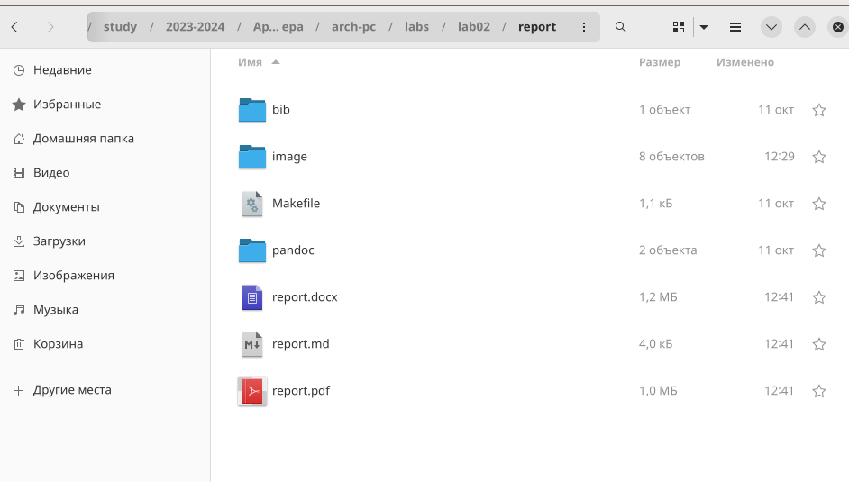

---
## Front matter
title: "Отчёт по лабараторной работе №4"
subtitle: "Дисциплина: архитектура компьютера"
author: "Бодунков Алексей Павлович"

## Generic otions
lang: ru-RU
toc-title: "Содержание"

## Bibliography
bibliography: bib/cite.bib
csl: pandoc/csl/gost-r-7-0-5-2008-numeric.csl

## Pdf output format
toc: true # Table of contents
toc-depth: 2
lof: true # List of figures
lot: true # List of tables
fontsize: 12pt
linestretch: 1.5
papersize: a4
documentclass: scrreprt
## I18n polyglossia
polyglossia-lang:
  name: russian
  options:
	- spelling=modern
	- babelshorthands=true
polyglossia-otherlangs:
  name: english
## I18n babel
babel-lang: russian
babel-otherlangs: english
## Fonts
mainfont: PT Serif
romanfont: PT Serif
sansfont: PT Sans
monofont: PT Mono
mainfontoptions: Ligatures=TeX
romanfontoptions: Ligatures=TeX
sansfontoptions: Ligatures=TeX,Scale=MatchLowercase
monofontoptions: Scale=MatchLowercase,Scale=0.9
## Biblatex
biblatex: true
biblio-style: "gost-numeric"
biblatexoptions:
  - parentracker=true
  - backend=biber
  - hyperref=auto
  - language=auto
  - autolang=other*
  - citestyle=gost-numeric
## Pandoc-crossref LaTeX customization
figureTitle: "Рис."
tableTitle: "Таблица"
listingTitle: "Листинг"
lofTitle: "Список иллюстраций"
lotTitle: "Список таблиц"
lolTitle: "Листинги"
## Misc options
indent: true
header-includes:
  - \usepackage{indentfirst}
  - \usepackage{float} # keep figures where there are in the text
  - \floatplacement{figure}{H} # keep figures where there are in the text
---

# Цель работы

Научиться работать с репозиторием на Github в командной строке ОС Linux. 

# Выполнение лабораторной работы

Произвожу базовую настройку git(В последней команде на рисунке была сделана ошибка, которая позже была исправлена) (рис. @fig:001).

{#fig:001 width=70%}

Создаю SSH ключ для идентификация пользователя на сервере репозиториев (рис. @fig:002).

{#fig:002 width=70%}

Вставка публичного ключа на аккаунте Github (рис. @fig:003).

{#fig:003 width=70%}

Создаю локальный репозиторий и клонирую в него данные с онлайн репозитория, который перед этим был скопирован с репозитория в тексте Лабараторной работы. (рис. @fig:004).

{#fig:004 width=70%}

Удаляю ненужные файлы и создаю необходимый каталог копируя его с онлайн репозитория (рис. @fig:005).

{#fig:005 width=70%}

Отправляю изменения и файлы на онлайн репозиторий (рис. @fig:006) (рис. @fig:007).

{#fig:006 width=70%}

{#fig:007 width=70%}

Проверяю что иерархии в локальном и онлайн репозиториях совпадают (рис. @fig:008).

{#fig:008 width=70%}

# Выполнение Самастоятельной работы

Создание отчёта второй Лабараторной работы(версия с текстом до этого момента) (рис. @fig:009)( рис. @fig:010).

{#fig:009 width=70%}

{#fig:010 width=70%}

Перемещение отчёта первой Лабараторной работы в локальный репозиторий (рис. @fig:011).

{#fig:011 width=70%}

Загрузка файлов на онлайн репозиторий(на рисунке отчёт неполный, позже был загружен полный (рис. @fig:012).

{#fig:012 width=70%}

# Выводы

Был изучен принцип загрузки файлов на репозиторий Github-а на базе ОС Linux.

# Ссылка на репозиторий

https://github.com/Valtrus/study_2023-2024_arh-pc
