---
## Front matter
title: "Отчёта по лабораторной работе №4"
subtitle: "Дисциплина: архитектура компьютера"
author: "Бодунков Алексей Павлович"

## Generic otions
lang: ru-RU
toc-title: "Содержание"

## Bibliography
bibliography: bib/cite.bib
csl: pandoc/csl/gost-r-7-0-5-2008-numeric.csl

## Pdf output format
toc: true # Table of contents
toc-depth: 2
lof: true # List of figures
fontsize: 12pt
linestretch: 1.5
papersize: a4
documentclass: scrreprt
## I18n polyglossia
polyglossia-lang:
  name: russian
  options:
	- spelling=modern
	- babelshorthands=true
polyglossia-otherlangs:
  name: english
## I18n babel
babel-lang: russian
babel-otherlangs: english
## Fonts
mainfont: PT Serif
romanfont: PT Serif
sansfont: PT Sans
monofont: PT Mono
mainfontoptions: Ligatures=TeX
romanfontoptions: Ligatures=TeX
sansfontoptions: Ligatures=TeX,Scale=MatchLowercase
monofontoptions: Scale=MatchLowercase,Scale=0.9
## Biblatex
biblatex: true
biblio-style: "gost-numeric"
biblatexoptions:
  - parentracker=true
  - backend=biber
  - hyperref=auto
  - language=auto
  - autolang=other*
  - citestyle=gost-numeric
## Pandoc-crossref LaTeX customization
figureTitle: "Рис."
listingTitle: "Листинг"
lofTitle: "Список иллюстраций"
lolTitle: "Листинги"
## Misc options
indent: true
header-includes:
  - \usepackage{indentfirst}
  - \usepackage{float} # keep figures where there are in the text
  - \floatplacement{figure}{H} # keep figures where there are in the text
---

# Цель Работы
Освоение процедуры написания, компиляции и выполнения программы, написанной на ассемблере NASM.

# Выполнение лабараторной работы

Сначало был создан текстовый файл в котором в будущем будет содержаться код для написания 'Hello World!' в отдельном каталоге для работы над этой лабараторной работой (рис. [-@fig:001]).

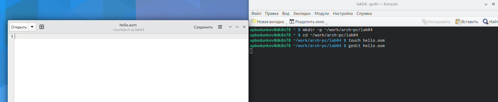{ #fig:001 width=70% }

Пишу нужный код в текстовом файле для вывода строки 'Hello world!' (рис. [-@fig:002]).

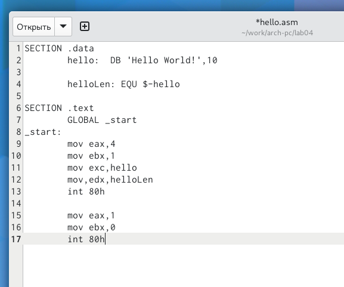{ #fig:002 wodth=70% }

Компилирую программу с помощью команды nasm (рис. [-@fig:003]).

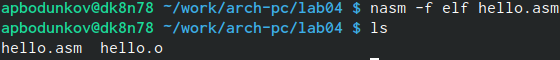{ #fig:003 width=70% }

Создаю объектный файл и файл листинга с помощью команды nasm (рис. [-@fig:004])

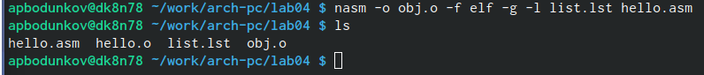{ #fig:004 width=70% }

Далее я создаю исполняемые файлы hello и main (рис. [-@fig:005]).

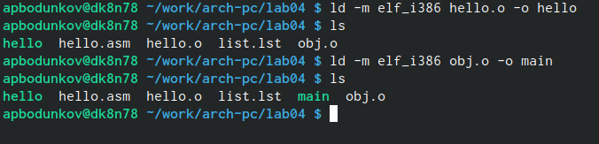{ #fig:005 width=70% }

Запускаю программу и она выводит нужную фразу 'Hello World!' (рис. [-@fig:006]).

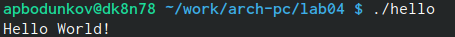{ #fig:006 width=70% }

# Выполнение самастоятельной работы

Создаю копию файла hello с именем lab4 (рис. [-@fig:007]).

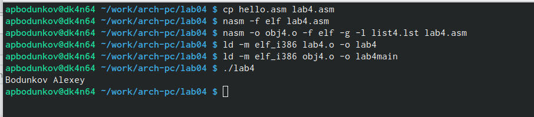{ #fig:007 width=70% }

Переделываю код программы для того, чтобы она выводила моё имя и фамилию (рис. [-@fig:008]).

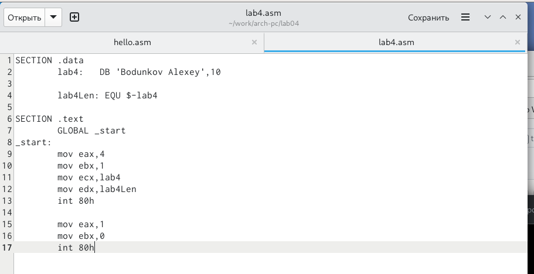{ #fig:008 width=70% }

Переношу обе программы в локальный репозиторий (рис. [-@fig:009]).

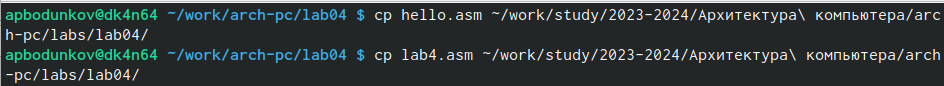{ #fig:009 width=70% }

Отправляю файлы на репозиторий на Github(рис. [-@fig:010]).

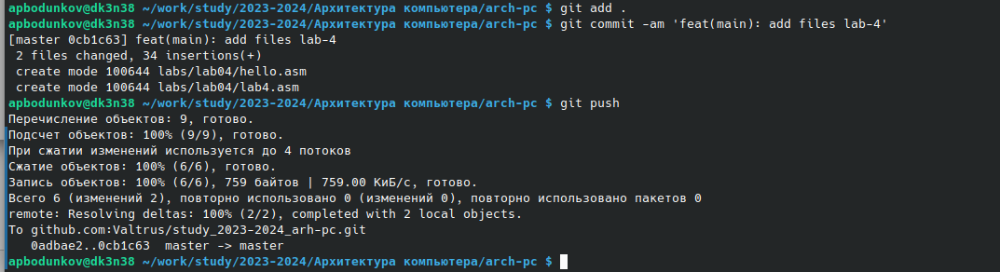{ #fig:010 width=70% }

Проверка что файлы успешно попали на репозиторий Github(рис. [-@fig:011]).

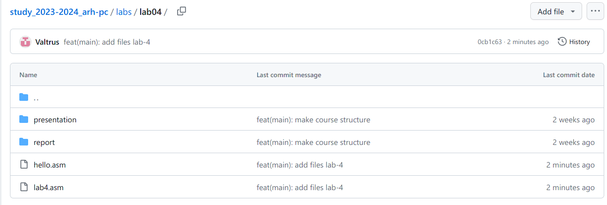{ #fig:011 width=70% }

# Выводы

В ходе выполнения данной лабароторной работы я научился базовому написанию программ на ассемблере NASM, а также из компиляции и исполнению.

